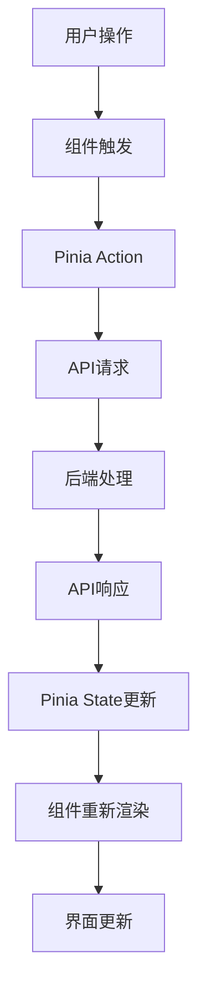

# 投资组合管理系统 (PMS) 前端技术架构设计

## 1. 技术栈选择

### 1.1 核心技术
- **框架**：Vue 3.5+
- **语言**：TypeScript 5.6+
- **构建工具**：Vite 6.0+
- **状态管理**：Pinia 2.1+
- **路由管理**：Vue Router 4.4+
- **UI组件库**：Element Plus 2.8+
- **数据可视化**：ECharts 5.5+
- **网络请求**：Axios 1.7+

### 1.2 辅助工具
- **代码规范**：ESLint + Prettier
- **类型检查**：Vue-TSC
- **单元测试**：Vitest
- **CSS预处理器**：SCSS
- **图标库**：Element Plus Icons

## 2. 目录结构设计

```
├── public/              # 静态资源
│   ├── favicon.ico
│   └── robots.txt
├── src/                 # 源代码
│   ├── assets/          # 资源文件
│   │   ├── styles/      # 全局样式
│   │   ├── images/      # 图片资源
│   │   └── icons/       # 图标资源
│   ├── components/      # 通用组件
│   │   ├── common/      # 基础组件
│   │   ├── layout/      # 布局组件
│   │   └── business/    # 业务组件
│   ├── views/           # 页面视图
│   │   ├── auth/        # 认证相关
│   │   ├── portfolio/   # 投资组合
│   │   ├── asset/       # 资产管理
│   │   ├── performance/ # 业绩分析
│   │   ├── market/      # 市场数据
│   │   ├── cash/        # 现金管理
│   │   └── report/      # 报告生成
│   ├── router/          # 路由配置
│   ├── store/           # 状态管理
│   │   ├── modules/     # 模块化状态
│   │   └── index.ts     # 状态管理入口
│   ├── api/             # API接口
│   │   ├── services/    # 服务层
│   │   └── types/       # 类型定义
│   ├── utils/           # 工具函数
│   │   ├── http.ts      # HTTP请求封装
│   │   ├── format.ts    # 格式化工具
│   │   └── storage.ts   # 存储工具
│   ├── types/           # 类型定义
│   ├── hooks/           # 自定义hooks
│   ├── App.vue          # 根组件
│   └── main.ts          # 入口文件
├── tests/               # 测试文件
├── .env                 # 环境变量
├── .eslintrc.js         # ESLint配置
├── .prettierrc.js       # Prettier配置
├── tsconfig.json        # TypeScript配置
├── vite.config.ts       # Vite配置
└── package.json         # 项目配置
```

## 3. 组件结构设计

### 3.1 布局组件
- **Layout**：整体布局组件，包含侧边栏、顶部导航和主内容区
- **Sidebar**：侧边栏组件，包含导航菜单
- **TopNav**：顶部导航栏组件，包含用户信息和操作按钮
- **PageHeader**：页面头部组件，包含页面标题和操作按钮
- **PageFooter**：页面底部组件，包含版权信息

### 3.2 通用组件
- **BaseButton**：基础按钮组件
- **BaseInput**：基础输入框组件
- **BaseSelect**：基础选择器组件
- **BaseTable**：基础表格组件
- **BaseChart**：基础图表组件
- **BaseModal**：基础模态框组件
- **BaseLoading**：基础加载组件
- **BaseEmpty**：基础空状态组件
- **BasePagination**：基础分页组件

### 3.3 业务组件
- **PortfolioCard**：投资组合卡片组件
- **AssetItem**：资产项目组件
- **HoldingsTable**：持仓表格组件
- **PerformanceChart**：业绩图表组件
- **RiskIndicator**：风险指标组件
- **MarketDataCard**：市场数据卡片组件
- **CashFlowTable**：现金流水表格组件
- **ReportGenerator**：报告生成组件

## 4. 页面设计

### 4.1 认证页面
- **Login**：登录页面
- **Register**：注册页面
- **ForgotPassword**：忘记密码页面
- **ResetPassword**：重置密码页面

### 4.2 投资组合页面
- **PortfolioList**：投资组合列表页面
- **PortfolioDetail**：投资组合详情页面
- **PortfolioCreate**：创建投资组合页面
- **PortfolioEdit**：编辑投资组合页面

### 4.3 资产管理页面
- **AssetList**：资产列表页面
- **AssetDetail**：资产详情页面
- **AssetAdd**：添加资产页面
- **AssetEdit**：编辑资产页面

### 4.4 业绩分析页面
- **PerformanceOverview**：业绩概览页面
- **PerformanceDetail**：业绩详细分析页面
- **RiskAnalysis**：风险分析页面
- **BenchmarkComparison**：基准对比页面

### 4.5 市场数据页面
- **MarketOverview**：市场概览页面
- **StockMarket**：股票市场页面
- **FundMarket**：基金市场页面
- **IndustrySector**：行业板块页面
- **MarketNews**：市场新闻页面

### 4.6 现金管理页面
- **CashBalance**：现金余额页面
- **CashFlow**：现金流水页面
- **FundPlan**：资金计划页面

### 4.7 报告生成页面
- **ReportList**：报告列表页面
- **ReportDetail**：报告详情页面
- **ReportCreate**：创建报告页面

## 5. 路由设计

```typescript
import { createRouter, createWebHistory } from 'vue-router'
import type { RouteRecordRaw } from 'vue-router'
import Layout from '@/components/layout/Layout.vue'

const routes: Array<RouteRecordRaw> = [
  // 认证路由
  {
    path: '/auth',
    component: () => import('@/views/auth/AuthLayout.vue'),
    children: [
      { path: 'login', component: () => import('@/views/auth/Login.vue') },
      { path: 'register', component: () => import('@/views/auth/Register.vue') },
      { path: 'forgot-password', component: () => import('@/views/auth/ForgotPassword.vue') },
      { path: 'reset-password', component: () => import('@/views/auth/ResetPassword.vue') }
    ]
  },
  // 主路由
  {
    path: '/',
    component: Layout,
    meta: { requiresAuth: true },
    children: [
      // 投资组合
      {
        path: 'portfolio',
        component: () => import('@/views/portfolio/PortfolioLayout.vue'),
        children: [
          { path: '', component: () => import('@/views/portfolio/PortfolioList.vue') },
          { path: 'create', component: () => import('@/views/portfolio/PortfolioCreate.vue') },
          { path: ':id', component: () => import('@/views/portfolio/PortfolioDetail.vue') },
          { path: ':id/edit', component: () => import('@/views/portfolio/PortfolioEdit.vue') }
        ]
      },
      // 资产管理
      {
        path: 'asset',
        component: () => import('@/views/asset/AssetLayout.vue'),
        children: [
          { path: '', component: () => import('@/views/asset/AssetList.vue') },
          { path: 'add', component: () => import('@/views/asset/AssetAdd.vue') },
          { path: ':id', component: () => import('@/views/asset/AssetDetail.vue') },
          { path: ':id/edit', component: () => import('@/views/asset/AssetEdit.vue') }
        ]
      },
      // 业绩分析
      {
        path: 'performance',
        component: () => import('@/views/performance/PerformanceLayout.vue'),
        children: [
          { path: '', component: () => import('@/views/performance/PerformanceOverview.vue') },
          { path: 'detail', component: () => import('@/views/performance/PerformanceDetail.vue') },
          { path: 'risk', component: () => import('@/views/performance/RiskAnalysis.vue') },
          { path: 'comparison', component: () => import('@/views/performance/BenchmarkComparison.vue') }
        ]
      },
      // 市场数据
      {
        path: 'market',
        component: () => import('@/views/market/MarketLayout.vue'),
        children: [
          { path: '', component: () => import('@/views/market/MarketOverview.vue') },
          { path: 'stock', component: () => import('@/views/market/StockMarket.vue') },
          { path: 'fund', component: () => import('@/views/market/FundMarket.vue') },
          { path: 'industry', component: () => import('@/views/market/IndustrySector.vue') },
          { path: 'news', component: () => import('@/views/market/MarketNews.vue') }
        ]
      },
      // 现金管理
      {
        path: 'cash',
        component: () => import('@/views/cash/CashLayout.vue'),
        children: [
          { path: '', component: () => import('@/views/cash/CashBalance.vue') },
          { path: 'flow', component: () => import('@/views/cash/CashFlow.vue') },
          { path: 'plan', component: () => import('@/views/cash/FundPlan.vue') }
        ]
      },
      // 报告生成
      {
        path: 'report',
        component: () => import('@/views/report/ReportLayout.vue'),
        children: [
          { path: '', component: () => import('@/views/report/ReportList.vue') },
          { path: 'create', component: () => import('@/views/report/ReportCreate.vue') },
          { path: ':id', component: () => import('@/views/report/ReportDetail.vue') }
        ]
      },
      // 首页
      { path: '', redirect: '/portfolio' }
    ]
  },
  // 404页面
  {
    path: '/:pathMatch(.*)*',
    component: () => import('@/views/NotFound.vue')
  }
]

const router = createRouter({
  history: createWebHistory(),
  routes
})

// 路由守卫
router.beforeEach((to, from, next) => {
  const requiresAuth = to.matched.some(record => record.meta.requiresAuth)
  const token = localStorage.getItem('token')
  
  if (requiresAuth && !token) {
    next('/auth/login')
  } else {
    next()
  }
})

export default router
```

## 6. 状态管理设计

### 6.1 状态模块划分
- **user**：用户状态管理
- **portfolio**：投资组合状态管理
- **asset**：资产状态管理
- **performance**：业绩分析状态管理
- **market**：市场数据状态管理
- **cash**：现金管理状态管理
- **report**：报告生成状态管理
- **ui**：UI状态管理（如加载状态、消息提示等）

### 6.2 用户状态模块

```typescript
// store/modules/user.ts
import { defineStore } from 'pinia'
import { ref, computed } from 'vue'
import { login, register, logout, getUserInfo } from '@/api/services/auth'
import type { User } from '@/types'

export const useUserStore = defineStore('user', () => {
  const user = ref<User | null>(null)
  const token = ref<string | null>(localStorage.getItem('token'))
  const loading = ref(false)
  const error = ref<string | null>(null)

  const isAuthenticated = computed(() => !!token.value)
  const isAdmin = computed(() => user.value?.role === 'admin')

  async function loginUser(credentials: { email: string; password: string }) {
    loading.value = true
    error.value = null
    try {
      const response = await login(credentials)
      token.value = response.token
      user.value = response.user
      localStorage.setItem('token', response.token)
      return response
    } catch (err: any) {
      error.value = err.message
      throw err
    } finally {
      loading.value = false
    }
  }

  async function registerUser(userData: { username: string; email: string; password: string; name: string }) {
    loading.value = true
    error.value = null
    try {
      const response = await register(userData)
      return response
    } catch (err: any) {
      error.value = err.message
      throw err
    } finally {
      loading.value = false
    }
  }

  async function logoutUser() {
    try {
      await logout()
    } finally {
      user.value = null
      token.value = null
      localStorage.removeItem('token')
    }
  }

  async function fetchUserInfo() {
    if (!token.value) return
    
    loading.value = true
    error.value = null
    try {
      const response = await getUserInfo()
      user.value = response
    } catch (err: any) {
      error.value = err.message
      // 如果获取用户信息失败，清除token
      if (err.status === 401) {
        user.value = null
        token.value = null
        localStorage.removeItem('token')
      }
    } finally {
      loading.value = false
    }
  }

  return {
    user,
    token,
    loading,
    error,
    isAuthenticated,
    isAdmin,
    loginUser,
    registerUser,
    logoutUser,
    fetchUserInfo
  }
})
```

### 6.3 投资组合状态模块

```typescript
// store/modules/portfolio.ts
import { defineStore } from 'pinia'
import { ref, computed } from 'vue'
import { getPortfolios, getPortfolioById, createPortfolio, updatePortfolio, deletePortfolio } from '@/api/services/portfolio'
import type { Portfolio, Holding } from '@/types'

export const usePortfolioStore = defineStore('portfolio', () => {
  const portfolios = ref<Portfolio[]>([])
  const currentPortfolio = ref<Portfolio | null>(null)
  const holdings = ref<Holding[]>([])
  const loading = ref(false)
  const error = ref<string | null>(null)

  const totalValue = computed(() => {
    return holdings.value.reduce((sum, holding) => {
      const value = parseFloat(holding.value) || 0
      return sum + value
    }, 0)
  })

  async function fetchPortfolios() {
    loading.value = true
    error.value = null
    try {
      const response = await getPortfolios()
      portfolios.value = response
    } catch (err: any) {
      error.value = err.message
    } finally {
      loading.value = false
    }
  }

  async function fetchPortfolioById(id: number) {
    loading.value = true
    error.value = null
    try {
      const response = await getPortfolioById(id)
      currentPortfolio.value = response.portfolio
      holdings.value = response.holdings
    } catch (err: any) {
      error.value = err.message
    } finally {
      loading.value = false
    }
  }

  async function createNewPortfolio(portfolioData: Partial<Portfolio>) {
    loading.value = true
    error.value = null
    try {
      const response = await createPortfolio(portfolioData)
      portfolios.value.push(response)
      return response
    } catch (err: any) {
      error.value = err.message
      throw err
    } finally {
      loading.value = false
    }
  }

  async function updateExistingPortfolio(id: number, portfolioData: Partial<Portfolio>) {
    loading.value = true
    error.value = null
    try {
      const response = await updatePortfolio(id, portfolioData)
      const index = portfolios.value.findIndex(p => p.id === id)
      if (index !== -1) {
        portfolios.value[index] = response
      }
      if (currentPortfolio.value?.id === id) {
        currentPortfolio.value = response
      }
      return response
    } catch (err: any) {
      error.value = err.message
      throw err
    } finally {
      loading.value = false
    }
  }

  async function deleteExistingPortfolio(id: number) {
    loading.value = true
    error.value = null
    try {
      await deletePortfolio(id)
      portfolios.value = portfolios.value.filter(p => p.id !== id)
      if (currentPortfolio.value?.id === id) {
        currentPortfolio.value = null
        holdings.value = []
      }
    } catch (err: any) {
      error.value = err.message
      throw err
    } finally {
      loading.value = false
    }
  }

  return {
    portfolios,
    currentPortfolio,
    holdings,
    loading,
    error,
    totalValue,
    fetchPortfolios,
    fetchPortfolioById,
    createNewPortfolio,
    updateExistingPortfolio,
    deleteExistingPortfolio
  }
})
```

## 7. API接口设计

### 7.1 认证接口
- `POST /api/auth/login`：用户登录
- `POST /api/auth/register`：用户注册
- `POST /api/auth/logout`：用户登出
- `GET /api/auth/me`：获取当前用户信息
- `POST /api/auth/forgot-password`：忘记密码
- `POST /api/auth/reset-password`：重置密码

### 7.2 投资组合接口
- `GET /api/portfolios`：获取投资组合列表
- `GET /api/portfolios/:id`：获取单个投资组合详情
- `POST /api/portfolios`：创建投资组合
- `PUT /api/portfolios/:id`：更新投资组合
- `DELETE /api/portfolios/:id`：删除投资组合

### 7.3 资产接口
- `GET /api/assets`：获取资产列表
- `GET /api/assets/:id`：获取单个资产详情
- `POST /api/assets`：添加资产
- `PUT /api/assets/:id`：更新资产
- `DELETE /api/assets/:id`：删除资产

### 7.4 持仓接口
- `GET /api/portfolios/:portfolioId/holdings`：获取投资组合持仓
- `POST /api/portfolios/:portfolioId/holdings`：添加持仓
- `PUT /api/portfolios/:portfolioId/holdings/:id`：更新持仓
- `DELETE /api/portfolios/:portfolioId/holdings/:id`：删除持仓

### 7.5 交易记录接口
- `GET /api/portfolios/:portfolioId/transactions`：获取交易记录
- `POST /api/portfolios/:portfolioId/transactions`：添加交易记录
- `GET /api/portfolios/:portfolioId/transactions/:id`：获取单个交易记录

### 7.6 现金流水接口
- `GET /api/portfolios/:portfolioId/cash-flows`：获取现金流水
- `POST /api/portfolios/:portfolioId/cash-flows`：添加现金流水
- `GET /api/portfolios/:portfolioId/cash-flows/:id`：获取单个现金流水

### 7.7 业绩分析接口
- `GET /api/portfolios/:portfolioId/performance`：获取业绩分析
- `GET /api/portfolios/:portfolioId/risk`：获取风险分析
- `GET /api/portfolios/:portfolioId/benchmark`：获取基准对比

### 7.8 市场数据接口
- `GET /api/market/stocks`：获取股票市场数据
- `GET /api/market/funds`：获取基金市场数据
- `GET /api/market/indices`：获取市场指数数据
- `GET /api/market/industries`：获取行业板块数据
- `GET /api/market/news`：获取市场新闻

### 7.9 报告接口
- `GET /api/reports`：获取报告列表
- `GET /api/reports/:id`：获取报告详情
- `POST /api/reports`：创建报告
- `GET /api/reports/:id/export`：导出报告

## 8. 数据流设计

### 8.1 前端数据流



### 8.2 数据流向
1. **用户操作**：用户在界面上进行操作，如点击按钮、填写表单等
2. **组件触发**：组件接收到用户操作，触发相应的方法
3. **Pinia Action**：调用Pinia store中的action方法
4. **API请求**：action方法通过API服务发送HTTP请求
5. **后端处理**：后端接收到请求，进行业务处理
6. **API响应**：后端返回处理结果
7. **Pinia State更新**：action方法根据响应结果更新store中的状态
8. **组件重新渲染**：状态更新触发组件重新渲染
9. **界面更新**：组件重新渲染后，界面显示最新数据

## 9. 响应式设计

### 9.1 设计原则
- **移动优先**：优先考虑移动设备的布局和交互
- **断点设计**：根据不同屏幕尺寸设置断点
- **弹性布局**：使用flexbox和grid实现弹性布局
- **响应式组件**：组件根据屏幕尺寸自适应调整
- **触控友好**：确保在移动设备上的触控体验

### 9.2 断点设置
- **移动设备**：< 768px
- **平板设备**：768px - 1024px
- **桌面设备**：> 1024px

### 9.3 响应式布局策略
- **侧边栏**：在移动设备上折叠为抽屉式菜单
- **表格**：在移动设备上转换为卡片式布局
- **图表**：根据屏幕尺寸调整大小和布局
- **表单**：在移动设备上调整为垂直布局
- **导航**：在移动设备上使用底部导航栏

## 10. 性能优化策略

### 10.1 前端性能优化
- **代码分割**：使用动态导入实现代码分割
- **懒加载**：图片和组件懒加载
- **缓存策略**：合理使用浏览器缓存
- **减少HTTP请求**：合并CSS和JS文件
- **压缩资源**：压缩HTML、CSS和JS文件
- **使用CDN**：静态资源使用CDN加速

### 10.2 渲染性能优化
- **虚拟滚动**：处理大数据列表
- **防抖和节流**：优化频繁触发的事件
- **减少重排和重绘**：合理使用CSS和DOM操作
- **使用CSS动画**：优先使用CSS动画而非JavaScript动画
- **预渲染**：对首屏进行预渲染

### 10.3 数据性能优化
- **分页加载**：大数据使用分页加载
- **数据缓存**：缓存常用数据
- **批量操作**：减少API请求次数
- **数据压缩**：使用gzip压缩数据
- **WebSocket**：实时数据使用WebSocket

## 11. 安全策略

### 11.1 前端安全
- **XSS防护**：使用Vue的自动转义功能
- **CSRF防护**：使用CSRF token
- **输入验证**：前端表单验证
- **敏感信息保护**：不在前端存储敏感信息
- **HTTPS**：使用HTTPS协议

### 11.2 认证安全
- **JWT token**：使用JWT进行身份验证
- **token过期**：设置合理的token过期时间
- **token刷新**：实现token自动刷新
- **密码加密**：前端密码加密传输
- **多因素认证**：支持多因素认证

### 11.3 数据安全
- **数据脱敏**：敏感数据脱敏显示
- **权限控制**：基于角色的权限控制
- **数据备份**：定期备份数据
- **审计日志**：记录关键操作日志

## 12. 测试策略

### 12.1 单元测试
- **组件测试**：测试组件的渲染和交互
- **工具函数测试**：测试工具函数的功能
- **状态管理测试**：测试Pinia store的状态管理
- **API服务测试**：测试API服务的调用

### 12.2 集成测试
- **页面测试**：测试完整页面的功能
- **流程测试**：测试完整业务流程
- **响应式测试**：测试不同设备的显示效果

### 12.3 端到端测试
- **用户场景测试**：模拟用户操作场景
- **性能测试**：测试系统性能
- **安全测试**：测试系统安全性

## 13. 部署策略

### 13.1 开发环境
- **本地开发**：使用Vite开发服务器
- **热更新**：支持代码热更新
- **调试工具**：使用Vue DevTools

### 13.2 测试环境
- **CI/CD**：配置持续集成和持续部署
- **自动化测试**：运行自动化测试
- **环境变量**：使用测试环境配置

### 13.3 生产环境
- **构建优化**：使用Vite生产构建
- **静态资源**：使用CDN加速静态资源
- **服务器配置**：优化服务器配置
- **监控告警**：配置系统监控和告警

## 14. 结论

本前端技术架构设计文档详细描述了投资组合管理系统的前端技术选型、目录结构、组件设计、路由配置、状态管理、API接口、数据流设计、响应式设计、性能优化、安全策略、测试策略和部署策略。

该架构采用现代化的Vue 3 + TypeScript技术栈，结合Element Plus和ECharts，构建一个功能完备、用户友好的投资组合管理系统。通过模块化设计和组件化开发，确保系统的可扩展性和可维护性。

该架构设计将作为前端开发的指导文件，确保开发团队按照统一的标准进行开发，提高开发效率和代码质量。