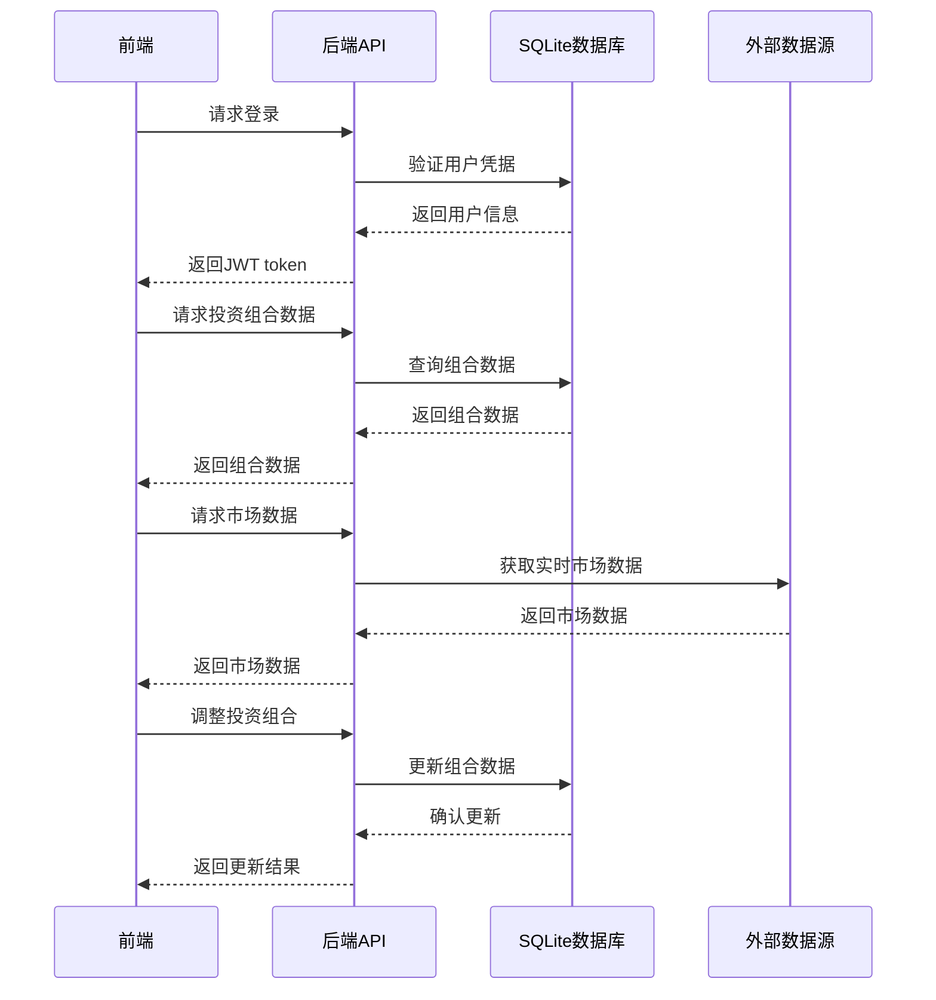

# 投资组合管理系统 (PMS) 需求规范文档

## 1. 项目概述

### 1.1 项目背景
随着个人和机构投资者的投资需求日益增长，投资组合管理变得越来越重要。传统的投资管理方式效率低下，难以满足现代投资者对实时数据、风险评估和业绩分析的需求。因此，开发一个现代化的投资组合管理系统，帮助投资者更有效地管理和分析投资组合，成为当前的迫切需求。

### 1.2 项目目标
本项目旨在开发一个功能完备、用户友好的投资组合管理系统，为个人和机构投资者提供以下核心功能：
- 实时监控投资组合表现
- 全面的资产配置分析
- 详细的业绩评估和风险分析
- 便捷的交易记录和现金管理
- 市场动态和新闻资讯

### 1.3 目标用户
- **个人投资者**：希望通过系统管理个人投资组合，获取专业的投资分析工具
- **投资顾问**：为客户提供投资建议和组合管理服务
- **小型投资机构**：需要一个成本效益高的投资管理解决方案

## 2. 功能需求

### 2.1 核心功能模块

#### 2.1.1 用户管理模块
- **用户注册与登录**：支持邮箱/手机号注册，密码登录，忘记密码功能
- **用户信息管理**：个人资料修改，密码重置，权限管理
- **角色管理**：支持管理员、普通用户等不同角色

#### 2.1.2 投资组合管理模块
- **组合创建与配置**：创建新的投资组合，设置组合名称、基准、风险偏好等
- **组合列表**：查看所有投资组合，支持搜索和筛选
- **组合详情**：查看单个组合的详细信息，包括资产配置、业绩表现等
- **组合调整**：添加/删除资产，调整持仓比例

#### 2.1.3 资产持仓模块
- **资产列表**：查看组合中的所有资产，包括股票、基金、债券等
- **资产详情**：查看单个资产的详细信息，包括价格、涨跌幅、持仓成本等
- **持仓分析**：分析持仓集中度、行业分布、地域分布等
- **交易记录**：查看资产的买入/卖出记录

#### 2.1.4 业绩分析模块
- **回报分析**：计算绝对回报、相对回报、年化收益等
- **风险评估**：计算波动率、夏普比率、最大回撤等风险指标
- **基准对比**：与指定基准（如沪深300）的表现对比
- **业绩归因**：分析不同资产类别对组合业绩的贡献

#### 2.1.5 市场数据模块
- **实时行情**：获取股票、基金等资产的实时价格和涨跌幅
- **市场指数**：查看主要市场指数的实时表现
- **行业板块**：查看不同行业板块的表现
- **市场新闻**：获取最新的市场新闻和资讯

#### 2.1.6 现金管理模块
- **资金流水**：记录资金的存入、取出、分红等流水
- **现金余额**：查看当前现金余额
- **资金计划**：制定资金使用计划

#### 2.1.7 报告生成模块
- **组合报告**：生成投资组合的详细报告，包括业绩、风险、资产配置等
- **自定义报告**：根据用户需求生成自定义报告
- **报告导出**：支持导出PDF、Excel等格式的报告

### 2.2 功能需求详情

| 功能点 | 描述 | 优先级 |
|-------|------|--------|
| 用户注册与登录 | 支持邮箱/手机号注册，密码登录，忘记密码功能 | 高 |
| 投资组合创建 | 创建新的投资组合，设置组合名称、基准、风险偏好等 | 高 |
| 资产持仓管理 | 添加/删除资产，调整持仓比例，查看持仓详情 | 高 |
| 业绩分析 | 计算回报率、风险指标，与基准对比 | 高 |
| 市场数据查询 | 获取实时行情、市场指数、行业板块表现 | 高 |
| 现金管理 | 记录资金流水，查看现金余额 | 中 |
| 报告生成 | 生成投资组合报告，支持导出 | 中 |
| 风险评估 | 评估投资组合的风险水平，提供风险预警 | 中 |
| 市场新闻 | 获取最新的市场新闻和资讯 | 低 |

## 3. 非功能需求

### 3.1 性能需求
- **响应时间**：页面加载时间不超过2秒，数据查询响应时间不超过1秒
- **并发处理**：支持至少100个并发用户同时访问系统
- **数据更新**：市场数据每5分钟更新一次，组合数据实时更新

### 3.2 安全需求
- **用户认证**：采用JWT token进行身份验证
- **数据加密**：敏感数据（如密码）采用加密存储
- **访问控制**：基于角色的访问控制，确保用户只能访问授权的资源
- **数据备份**：定期备份系统数据，确保数据安全

### 3.3 可用性需求
- **系统可用性**：系统正常运行时间达到99.9%
- **故障恢复**：系统出现故障后，能在30分钟内恢复正常运行
- **数据一致性**：确保数据在不同设备和平台上的一致性

### 3.4 可扩展性需求
- **模块化设计**：采用模块化设计，便于功能扩展和维护
- **API接口**：提供标准化的API接口，支持与其他系统集成
- **数据存储**：支持数据量的增长，可根据需要扩展存储容量

### 3.5 用户体验需求
- **响应式设计**：支持桌面端、平板和手机等多种设备访问
- **界面美观**：界面设计简洁、美观，符合现代UI设计标准
- **操作便捷**：操作流程简单明了，减少用户操作步骤
- **信息清晰**：数据展示清晰易懂，图表直观美观

## 4. 技术架构

### 4.1 前端技术栈
- **框架**：Vue 3 + TypeScript
- **状态管理**：Pinia
- **UI组件库**：Element Plus
- **数据可视化**：ECharts
- **网络请求**：Axios
- **构建工具**：Vite
- **路由管理**：Vue Router

### 4.2 后端技术栈
- **语言**：Python 3.9+
- **Web框架**：Flask
- **数据库**：SQLite
- **ORM**：SQLAlchemy
- **认证**：Flask-JWT-Extended
- **API文档**：Flask-RESTPlus
- **数据采集**：Requests + BeautifulSoup4（用于获取市场数据）

### 4.3 系统架构

## 5. 数据模型设计

### 5.1 核心数据表

#### 5.1.1 用户表 (users)
| 字段名 | 数据类型 | 约束 | 描述 |
|-------|---------|------|------|
| id | INTEGER | PRIMARY KEY | 用户ID |
| username | VARCHAR(50) | UNIQUE NOT NULL | 用户名 |
| email | VARCHAR(100) | UNIQUE NOT NULL | 邮箱 |
| password_hash | VARCHAR(255) | NOT NULL | 密码哈希 |
| name | VARCHAR(100) | NOT NULL | 真实姓名 |
| role | VARCHAR(20) | NOT NULL DEFAULT 'user' | 角色（admin/user） |
| created_at | TIMESTAMP | NOT NULL DEFAULT CURRENT_TIMESTAMP | 创建时间 |
| updated_at | TIMESTAMP | NOT NULL DEFAULT CURRENT_TIMESTAMP | 更新时间 |

#### 5.1.2 投资组合表 (portfolios)
| 字段名 | 数据类型 | 约束 | 描述 |
|-------|---------|------|------|
| id | INTEGER | PRIMARY KEY | 组合ID |
| user_id | INTEGER | NOT NULL REFERENCES users(id) | 用户ID |
| name | VARCHAR(100) | NOT NULL | 组合名称 |
| description | TEXT | | 组合描述 |
| benchmark | VARCHAR(50) | NOT NULL | 业绩基准 |
| risk_level | VARCHAR(20) | NOT NULL | 风险等级 |
| created_at | TIMESTAMP | NOT NULL DEFAULT CURRENT_TIMESTAMP | 创建时间 |
| updated_at | TIMESTAMP | NOT NULL DEFAULT CURRENT_TIMESTAMP | 更新时间 |

#### 5.1.3 资产表 (assets)
| 字段名 | 数据类型 | 约束 | 描述 |
|-------|---------|------|------|
| id | INTEGER | PRIMARY KEY | 资产ID |
| code | VARCHAR(20) | UNIQUE NOT NULL | 资产代码 |
| name | VARCHAR(100) | NOT NULL | 资产名称 |
| type | VARCHAR(20) | NOT NULL | 资产类型（股票/基金/债券等） |
| market | VARCHAR(50) | NOT NULL | 市场（A股/港股/美股等） |
| industry | VARCHAR(50) | | 所属行业 |
| created_at | TIMESTAMP | NOT NULL DEFAULT CURRENT_TIMESTAMP | 创建时间 |
| updated_at | TIMESTAMP | NOT NULL DEFAULT CURRENT_TIMESTAMP | 更新时间 |

#### 5.1.4 持仓表 (holdings)
| 字段名 | 数据类型 | 约束 | 描述 |
|-------|---------|------|------|
| id | INTEGER | PRIMARY KEY | 持仓ID |
| portfolio_id | INTEGER | NOT NULL REFERENCES portfolios(id) | 组合ID |
| asset_id | INTEGER | NOT NULL REFERENCES assets(id) | 资产ID |
| quantity | DECIMAL(18,4) | NOT NULL | 持仓数量 |
| cost_price | DECIMAL(18,4) | NOT NULL | 持仓成本价 |
| current_price | DECIMAL(18,4) | NOT NULL | 当前价格 |
| created_at | TIMESTAMP | NOT NULL DEFAULT CURRENT_TIMESTAMP | 创建时间 |
| updated_at | TIMESTAMP | NOT NULL DEFAULT CURRENT_TIMESTAMP | 更新时间 |

#### 5.1.5 交易记录表 (transactions)
| 字段名 | 数据类型 | 约束 | 描述 |
|-------|---------|------|------|
| id | INTEGER | PRIMARY KEY | 交易ID |
| portfolio_id | INTEGER | NOT NULL REFERENCES portfolios(id) | 组合ID |
| asset_id | INTEGER | NOT NULL REFERENCES assets(id) | 资产ID |
| type | VARCHAR(10) | NOT NULL | 交易类型（买入/卖出） |
| quantity | DECIMAL(18,4) | NOT NULL | 交易数量 |
| price | DECIMAL(18,4) | NOT NULL | 交易价格 |
| amount | DECIMAL(18,2) | NOT NULL | 交易金额 |
| fee | DECIMAL(18,2) | DEFAULT 0 | 交易费用 |
| transaction_date | TIMESTAMP | NOT NULL | 交易日期 |
| created_at | TIMESTAMP | NOT NULL DEFAULT CURRENT_TIMESTAMP | 创建时间 |

#### 5.1.6 现金流水表 (cash_flows)
| 字段名 | 数据类型 | 约束 | 描述 |
|-------|---------|------|------|
| id | INTEGER | PRIMARY KEY | 流水ID |
| portfolio_id | INTEGER | NOT NULL REFERENCES portfolios(id) | 组合ID |
| type | VARCHAR(20) | NOT NULL | 流水类型（存入/取出/分红/利息等） |
| amount | DECIMAL(18,2) | NOT NULL | 金额 |
| description | TEXT | | 描述 |
| transaction_date | TIMESTAMP | NOT NULL | 交易日期 |
| created_at | TIMESTAMP | NOT NULL DEFAULT CURRENT_TIMESTAMP | 创建时间 |

#### 5.1.7 市场数据表 (market_data)
| 字段名 | 数据类型 | 约束 | 描述 |
|-------|---------|------|------|
| id | INTEGER | PRIMARY KEY | 数据ID |
| asset_id | INTEGER | NOT NULL REFERENCES assets(id) | 资产ID |
| date | DATE | NOT NULL | 日期 |
| open | DECIMAL(18,4) | NOT NULL | 开盘价 |
| high | DECIMAL(18,4) | NOT NULL | 最高价 |
| low | DECIMAL(18,4) | NOT NULL | 最低价 |
| close | DECIMAL(18,4) | NOT NULL | 收盘价 |
| volume | DECIMAL(20,2) | NOT NULL | 成交量 |
| amount | DECIMAL(20,2) | NOT NULL | 成交额 |
| created_at | TIMESTAMP | NOT NULL DEFAULT CURRENT_TIMESTAMP | 创建时间 |

## 6. 实施计划

### 6.1 项目阶段

#### 阶段一：需求分析与设计
- 完成需求分析和功能规划
- 设计系统架构和数据模型
- 制定详细的开发计划

#### 阶段二：后端开发
- 搭建Flask后端框架
- 实现用户认证和授权
- 开发核心API接口
- 实现数据库操作和业务逻辑

#### 阶段三：前端开发
- 搭建Vue 3前端框架
- 实现用户界面和交互
- 集成ECharts数据可视化
- 实现响应式设计

#### 阶段四：集成测试
- 后端API测试
- 前端功能测试
- 系统集成测试
- 性能测试

#### 阶段五：部署与上线
- 系统部署
- 用户培训
- 系统上线

### 6.2 里程碑

| 里程碑 | 时间 | 完成内容 |
|-------|------|---------|
| 需求分析完成 | 第1周 | 完成需求分析和功能规划，设计系统架构和数据模型 |
| 后端核心功能完成 | 第3周 | 完成后端框架搭建，实现用户认证和核心API接口 |
| 前端核心功能完成 | 第5周 | 完成前端框架搭建，实现用户界面和基本功能 |
| 系统集成完成 | 第6周 | 完成前后端集成，进行系统测试 |
| 系统上线 | 第7周 | 完成系统部署和用户培训，系统正式上线 |

## 7. 验收标准

### 7.1 功能验收
- **用户管理**：能够成功注册、登录，修改个人信息
- **投资组合管理**：能够创建、查看、修改投资组合
- **资产持仓管理**：能够添加、删除资产，调整持仓比例
- **业绩分析**：能够查看组合的回报率、风险指标，与基准对比
- **市场数据**：能够获取实时行情、市场指数、行业板块表现
- **现金管理**：能够记录资金流水，查看现金余额
- **报告生成**：能够生成投资组合报告，支持导出

### 7.2 性能验收
- **响应时间**：页面加载时间不超过2秒，数据查询响应时间不超过1秒
- **并发处理**：能够支持100个并发用户同时访问系统
- **数据更新**：市场数据每5分钟更新一次，组合数据实时更新

### 7.3 安全验收
- **用户认证**：JWT token认证正常工作
- **数据加密**：敏感数据加密存储
- **访问控制**：基于角色的访问控制有效
- **数据备份**：数据备份功能正常

### 7.4 可用性验收
- **系统可用性**：系统正常运行时间达到99.9%
- **故障恢复**：系统出现故障后，能在30分钟内恢复正常运行
- **数据一致性**：数据在不同设备和平台上保持一致

### 7.5 用户体验验收
- **响应式设计**：在桌面端、平板和手机上都能正常显示
- **界面美观**：界面设计简洁、美观，符合现代UI设计标准
- **操作便捷**：操作流程简单明了，减少用户操作步骤
- **信息清晰**：数据展示清晰易懂，图表直观美观

## 8. 风险评估

### 8.1 技术风险
- **市场数据获取**：外部数据源可能不稳定，影响数据更新
- **系统性能**：随着数据量增长，系统性能可能下降
- **安全性**：用户数据和投资信息需要高度安全保障

### 8.2 业务风险
- **需求变更**：用户需求可能在开发过程中发生变化
- **法规合规**：投资相关功能需要符合相关法规要求
- **数据准确性**：市场数据和投资分析结果的准确性至关重要

### 8.3 应对措施
- **技术风险应对**：
  - 实现多个数据源的备份，确保数据获取的可靠性
  - 优化数据库查询和缓存机制，提高系统性能
  - 采用加密技术和访问控制，保障数据安全

- **业务风险应对**：
  - 建立需求变更管理流程，及时响应用户需求变化
  - 咨询法律专家，确保系统符合相关法规要求
  - 建立数据验证机制，确保数据准确性

## 9. 结论

本需求规范文档详细描述了投资组合管理系统的功能需求、非功能需求、技术架构和实施计划。该系统将为个人和机构投资者提供一个功能完备、用户友好的投资管理工具，帮助他们更有效地管理和分析投资组合，做出更明智的投资决策。

系统采用现代化的技术栈，包括Vue 3 + TypeScript前端和Flask + SQLite后端，具有良好的可扩展性和可维护性。通过分阶段实施和严格的验收标准，确保系统能够按时、高质量地完成。

本需求规范文档将作为系统开发的指导文件，确保开发团队和相关方对系统需求有清晰的理解，为系统的成功实施奠定基础。